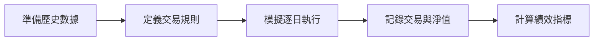

# 📈 股票回測與分析平台

> 一站式台股回測、AI 掃描與潛力股篩選系統


## 🎯 專案簡介

此專案是一個全功能的**台股投資分析平台**，整合了：

- 🔄 **歷史回測引擎**：支援 24 種交易策略，包含均線交叉、RSI、MACD、布林通道等
- 🤖 **AI 價格預測**：結合線性回歸、移動平均趨勢、蒙地卡羅模擬三種方法
- 📡 **即時技術訊號**：自動偵測黃金交叉、死亡交叉、RSI 超買超賣等訊號
- 💎 **潛力股篩選**：整合 1300+ 檔上市櫃股票，AI 智能評分排序
- 📊 **多檔比較**：同時比較多檔股票的相對績效走勢

採用**模組化分層架構**，將資料取得、策略判斷、回測引擎、績效分析與使用者介面彼此解耦，讓每個模組能獨立演進與替換。

## ✨ 功能特色

| 功能 | 說明 |
|------|------|
| 🏠 **市場總覽** | 即時顯示上漲/下跌家數、成交量、市場情緒指標 |
| 📊 **單檔回測** | 設定股票代號、期間與策略參數，查看權益曲線與績效指標 |
| 📈 **多檔比較** | 挑選最多六檔標的，檢視相對報酬表現 |
| 📡 **AI 掃描** | 即時掃描熱門指標與技術訊號 |
| 💎 **潛力股** | 依成交量、技術指標與 AI 評分篩選值得追蹤的標的 |
| ⚡ **即時訊號** | 顯示黃金交叉、RSI 超買超賣等關鍵買賣訊號 |

## 🖼️ 畫面預覽

```
┌─────────────────────────────────────────────────────────────┐
│  📊 市場總覽                                    🔄 重新整理  │
├─────────────────────────────────────────────────────────────┤
│  📈 上漲 650  │  📉 下跌 580  │  ➡️ 平盤 70  │  💹 250億    │
├─────────────────────────────────────────────────────────────┤
│  ⚡ 即時技術訊號                                            │
│  ┌──────────────────┐  ┌──────────────────┐                │
│  │ 台積電 2330      │  │ 鴻海 2317        │                │
│  │ 黃金交叉 🟢 買入 │  │ RSI超買 🔴 賣出  │                │
│  └──────────────────┘  └──────────────────┘                │
├─────────────────────────────────────────────────────────────┤
│  🔥 熱門股票  │  ⭐ 系統推薦  │  💡 功能介紹                │
└─────────────────────────────────────────────────────────────┘
```

## 🚀 快速開始

### 環境需求
- Node.js >= 18
- npm >= 9

### 安裝與啟動

```bash
# 1. Clone 專案
git clone https://github.com/310182-sketch/stock.git
cd stock

# 2. 安裝依賴
npm install

# 3. 啟動後端 (Port 3001)
cd backend && npm start &

# 4. 啟動前端 (Port 5173)
cd ../frontend && npm run dev
```

### 存取應用
- 前端介面：http://localhost:5173
- 後端 API：http://localhost:3001

## 📖 什麼是回測（Backtesting）？

回測就是「把交易策略套用在過去的歷史資料上，模擬當時如果照這套規則進出，結果會發生什麼事」。透過回測，你可以在不冒實際金錢風險的情況下，先了解策略的大致報酬、波動和風險特性。

### 典型的回測流程



- **準備歷史數據**：如日 K OHLCV（開高低收與成交量）
- **定義交易規則**：例如「短均線上穿長均線就買進，反向交叉就賣出」
- **模擬逐日執行**：走過歷史資料，按照規則下單與平倉
- **記錄交易與淨值**：計算總報酬率、最大回檔、勝率等指標

> ⚠️ 回測不是在預測「未來一定會這樣走」，而是在檢查「這套策略過去是否有一致性與合理的風險報酬」，以幫助你篩選掉明顯不穩定或過度樂觀的想法。

## 🏗️ 核心架構層級

```
┌─────────────────────────────────────────────────────────────┐
│                      前端展示層 (React)                      │
│         Dashboard / StockScanner / PotentialStocks          │
├─────────────────────────────────────────────────────────────┤
│                       API 層 (Express)                       │
│              /api/tw/backtest, /api/tw/scan, ...            │
├─────────────────────────────────────────────────────────────┤
│  ┌──────────┐  ┌──────────┐  ┌──────────┐  ┌──────────┐    │
│  │  資料層  │  │  策略層  │  │  引擎層  │  │  分析層  │    │
│  │twStockData│ │Strategies│ │BacktestEng│ │ Metrics  │    │
│  └──────────┘  └──────────┘  └──────────┘  └──────────┘    │
├─────────────────────────────────────────────────────────────┤
│                    持久化層 (lowdb JSON)                     │
│                     stocks-db.json                          │
└─────────────────────────────────────────────────────────────┘
```

### 1. 資料層（`twStockData`）
- 從 TWSE/TPEx 取得真實台股歷史資料
- 支援即時報價與歷史 K 線查詢
- 自動快取與 fallback 機制

### 2. 策略層（`Strategies` 集合）
- 將交易決策封裝為獨立函式
- 支援 24 種策略：均線交叉、RSI、MACD、布林通道、海龜交易等
- 可自訂參數，易於擴充新策略

### 3. 引擎層（`BacktestEngine`）
- 模擬時間推進，執行策略決策與下單
- 建立權益曲線，避免未來函數偏誤
- 支援部位管理與資金控管

### 4. 分析層（`Metrics`）
- 計算績效指標：總報酬率、勝率、最大回檔
- 可延伸 Sharpe Ratio、Sortino Ratio 等進階指標

### 5. 展示層（React + Recharts）
- 互動式參數設定介面
- 即時圖表與績效儀表板
- 響應式設計，支援桌面與行動裝置

## 📊 支援的交易策略

| 類別 | 策略 |
|------|------|
| **均線類** | 均線交叉、三均線系統、均線乖離 |
| **動能類** | RSI 反轉、MACD 交叉、KD 隨機指標 |
| **通道類** | 布林通道、乖離率突破、ATR 通道 |
| **趨勢類** | 海龜交易、唐奇安通道、趨勢追蹤 |
| **組合類** | 綜合指標、多因子模型 |

## 📁 專案結構

```
stock/
├── backend/                 # 後端 API 服務
│   ├── src/
│   │   ├── app.js          # Express 主程式
│   │   ├── data/           # 資料模組
│   │   ├── engine/         # 回測引擎
│   │   ├── analytics/      # 績效分析
│   │   ├── strategies/     # 交易策略
│   │   ├── db/             # 資料庫操作
│   │   ├── integrations/   # 外部 API 整合
│   │   └── jobs/           # 排程任務
│   └── data/               # JSON 資料儲存
│
├── frontend/               # 前端 React 應用
│   ├── src/
│   │   ├── App.jsx         # 主元件
│   │   ├── Dashboard.jsx   # 總覽儀表板
│   │   ├── StockScanner.jsx # AI 掃描
│   │   ├── PotentialStocks.jsx # 潛力股
│   │   └── api.js          # API 呼叫
│   └── public/
│
└── README.md
```

## 🔌 API 端點

### 股票資料
| 方法 | 端點 | 說明 |
|------|------|------|
| GET | `/api/tw/stocks` | 取得股票清單 |
| GET | `/api/tw/realtime/:symbol` | 取得即時報價 |
| GET | `/api/tw/history/:symbol` | 取得歷史 K 線 |
| GET | `/api/tw/potential-stocks` | 取得潛力股清單 |

### 回測與分析
| 方法 | 端點 | 說明 |
|------|------|------|
| POST | `/api/tw/backtest` | 執行單檔回測 |
| POST | `/api/tw/compare` | 多檔績效比較 |
| POST | `/api/tw/scan` | AI 掃描分析 |
| POST | `/api/tw/predict` | 價格預測 |

### 系統
| 方法 | 端點 | 說明 |
|------|------|------|
| GET | `/health` | 健康檢查 |
| GET | `/api/strategies` | 取得可用策略 |

## ⚙️ 環境變數設定

```bash
# 後端 API 設定
PORT=3001                              # API 服務埠

# TWSE OpenAPI 整合（選用）
TWSE_OPENAPI_BASE=https://openapi.twse.com.tw
OPENAPI_TWSE_KEY=your_api_key          # API 金鑰
TWSE_SYNC_ENABLED=1                    # 啟用排程同步
TWSE_SYNC_SYMBOLS=2330,2317,0050       # 同步股票清單
TWSE_SYNC_INTERVAL_MS=300000           # 同步間隔（毫秒）

# 前端設定
VITE_API_BASE=/api                     # API 基礎路徑
```

## 🧪 開發指令

```bash
# 後端開發模式（自動重載）
cd backend && npm run dev

# 前端開發模式
cd frontend && npm run dev

# 同時啟動前後端
npm run start
```

## 📈 效能特點

- **快取機制**：歷史資料本地快取，減少 API 呼叫
- **批次處理**：大量股票資料採批次更新
- **延遲載入**：圖表與資料按需載入
- **響應式設計**：適配各種螢幕尺寸

## 🛡️ 風險聲明

> ⚠️ **免責聲明**
> 
> 本系統僅供學習與研究用途，不構成任何投資建議。
> 過去績效不代表未來表現，投資有風險，請謹慎評估。

## 🤝 貢獻

歡迎提交 Issue 與 Pull Request！

1. Fork 此專案
2. 建立功能分支 (`git checkout -b feature/amazing-feature`)
3. 提交變更 (`git commit -m 'Add amazing feature'`)
4. 推送分支 (`git push origin feature/amazing-feature`)
5. 開啟 Pull Request

## 📄 授權

ISC License - 詳見 [LICENSE](LICENSE)

---

<p align="center">
  Made with ❤️ for Taiwan Stock Market
</p>